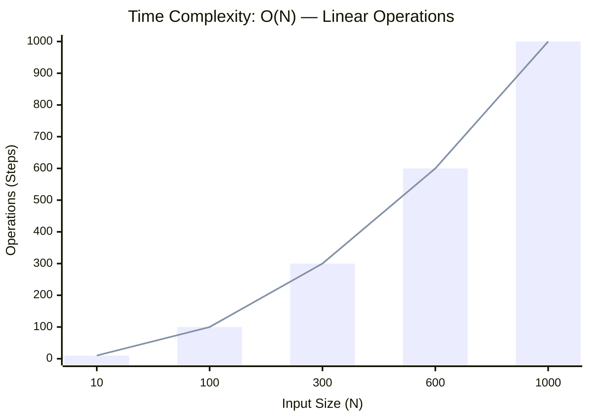

<h2><a href="https://leetcode.com/problems/remove-duplicates-from-sorted-array/submissions/2124085415/">26. Remove Duplicates from Sorted Array</a></h2><h3>Medium</h3>

Given an integer array <code>nums</code> sorted in <strong>non-decreasing order</strong>, remove the duplicates <a href="https://en.wikipedia.org/wiki/In-place_algorithm" target="_blank"><strong>in-place</strong></a> such that each unique element appears only <strong>once</strong>. The <strong>relative order</strong> of the elements should be kept the <strong>same</strong>.

Consider the number of <em>unique elements</em> in&nbsp;<code>nums</code> to be <code>k<strong>​​​​​​​</strong></code>​​​​​​​. After removing duplicates, return the number of unique elements&nbsp;<code>k</code>.

The first&nbsp;<code>k</code>&nbsp;elements of&nbsp;<code>nums</code>&nbsp;should contain the unique numbers in <strong>sorted order</strong>. The remaining elements beyond index&nbsp;<code>k - 1</code>&nbsp;can be ignored.

<strong>Custom Judge:</strong>

The judge will test your solution with the following code:

<pre>
int[] nums = [...]; // Input array
int[] expectedNums = [...]; // The expected answer with correct length

int k = removeDuplicates(nums); // Calls your implementation

assert k == expectedNums.length;
for (int i = 0; i &lt; k; i++) {
    assert nums[i] == expectedNums[i];
}
</pre>

If all assertions pass, then your solution will be <strong>accepted</strong>.

&nbsp;

<strong class="example">Example 1:</strong>

<pre>
<strong>Input:</strong> nums = [1,1,2]
<strong>Output:</strong> 2, nums = [1,2,_]
<strong>Explanation:</strong> Your function should return k = 2, with the first two elements of nums being 1 and 2 respectively.
It does not matter what you leave beyond the returned k (hence they are underscores).
</pre>

<strong class="example">Example 2:</strong>

<pre>
<strong>Input:</strong> nums = [0,0,1,1,1,2,2,3,3,4]
<strong>Output:</strong> 5, nums = [0,1,2,3,4,_,_,_,_,_]
<strong>Explanation:</strong> Your function should return k = 5, with the first five elements of nums being 0, 1, 2, 3, and 4 respectively.
It does not matter what you leave beyond the returned k (hence they are underscores).
</pre>

&nbsp;

<strong>Constraints:</strong>

<ul>
	<li><code>1 &lt;= nums.length &lt;= 3 * 104</code></li>
	<li><code>-100 &lt;= nums[i] &lt;= 100</code></li>
	<li><code>nums</code> is sorted in <strong>non-decreasing</strong> order.</li>
</ul>

### 📊 Submission Statistics
- **Language:** `cpp`
- **Runtime:** `0 ms`
- **Memory:** `N/A`
- **Submission Date:** Sat, 29 Aug 2026 16:00:55 GMT

---

### 💡 Approach & Complexity Analysis
#### 🧠 Intuition & Algorithmic Strategy
- **Approach:** Utilizes frequency counting or presence tracking via hash mapping for O(1) membership queries.
- **Flow:**
  1. Initialize state variables and inspect base constraints.
  2. Iterate through input elements, maintaining current progress and boundaries.
  3. Return the calculated result satisfying problem criteria.

#### ⏱️ Complexity Analysis
- **Time Complexity:** $\mathcal{O}(N)$ — *Single linear pass over the input collection.*
- **Space Complexity:** $\mathcal{O}(N)$ — *Auxiliary hash-based lookup structure storing up to N elements.*

#### 📈 Time Complexity Graph (Operations vs Input Size $N$)

#### 📦 Space Complexity Graph (Memory Footprint vs Input Size $N$)

---
*Auto-synced with [LeetGitSyncPro](https://synccode-pro.pages.dev) & [DSATracker](https://dsatracker.in)*
