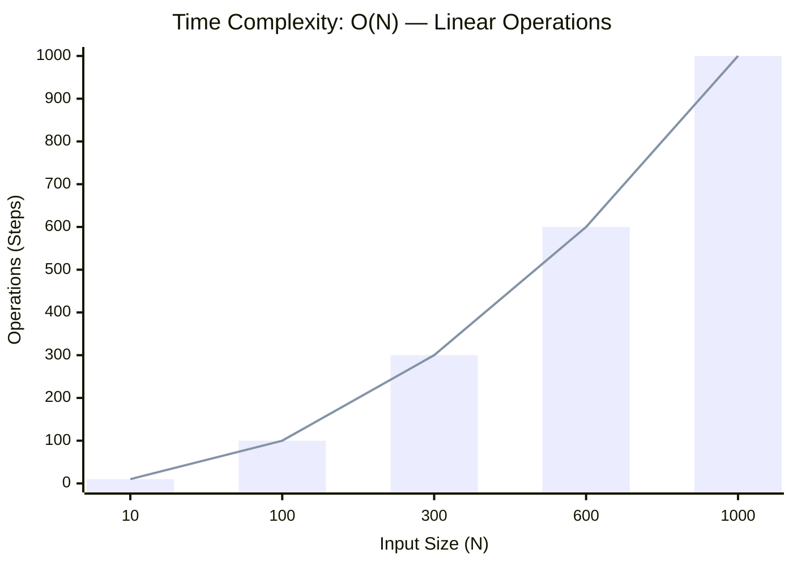

<h2><a href="https://leetcode.com/problems/check-if-array-is-sorted-and-rotated/submissions/2123919633/">Check if Array Is Sorted and Rotated</a></h2><h3>Easy</h3>

Given an array <code>nums</code>, return <code>true</code><em> if the array was originally sorted in non-decreasing order, then rotated <strong>some</strong> number of positions (including zero)</em>. Otherwise, return <code>false</code>.

There may be <strong>duplicates</strong> in the original array.

<strong>Note:</strong> An array <code>A</code> rotated by <code>x</code> positions results in an array <code>B</code> of the same length such that <code>B[i] == A[(i+x) % A.length]</code> for every valid index <code>i</code>.

&nbsp;

<strong class="example">Example 1:</strong>

<pre><strong>Input:</strong> nums = [3,4,5,1,2]
<strong>Output:</strong> true
<strong>Explanation:</strong> [1,2,3,4,5] is the original sorted array.
You can rotate the array by x = 2 positions to begin on the element of value 3: [3,4,5,1,2].
</pre>

<strong class="example">Example 2:</strong>

<pre><strong>Input:</strong> nums = [2,1,3,4]
<strong>Output:</strong> false
<strong>Explanation:</strong> There is no sorted array once rotated that can make nums.
</pre>

<strong class="example">Example 3:</strong>

<pre><strong>Input:</strong> nums = [1,2,3]
<strong>Output:</strong> true
<strong>Explanation:</strong> [1,2,3] is the original sorted array.
You can rotate the array by x = 0 positions (i.e. no rotation) to make nums.
</pre>

&nbsp;

<strong>Constraints:</strong>

<ul>
	<li><code>1 &lt;= nums.length &lt;= 100</code></li>
	<li><code>1 &lt;= nums[i] &lt;= 100</code></li>
</ul>

### 📊 Submission Statistics
- **Language:** `cpp`
- **Runtime:** `0 ms`
- **Memory:** `N/A`
- **Submission Date:** Sat, 29 Aug 2026 14:32:51 GMT

---

### 💡 Approach & Complexity Analysis
#### 🧠 Intuition & Algorithmic Strategy
- **Approach:** Utilizes frequency counting or presence tracking via hash mapping for O(1) membership queries.
- **Flow:**
  1. Initialize state variables and inspect base constraints.
  2. Iterate through input elements, maintaining current progress and boundaries.
  3. Return the calculated result satisfying problem criteria.

#### ⏱️ Complexity Analysis
- **Time Complexity:** $\mathcal{O}(N)$ — *Single linear pass over the input collection.*
- **Space Complexity:** $\mathcal{O}(N)$ — *Auxiliary hash-based lookup structure storing up to N elements.*

#### 📈 Time Complexity Graph (Operations vs Input Size $N$)

#### 📦 Space Complexity Graph (Memory Footprint vs Input Size $N$)

---
*Auto-synced with [LeetGitSyncPro](https://synccode-pro.pages.dev) & [DSATracker](https://dsatracker.in)*
