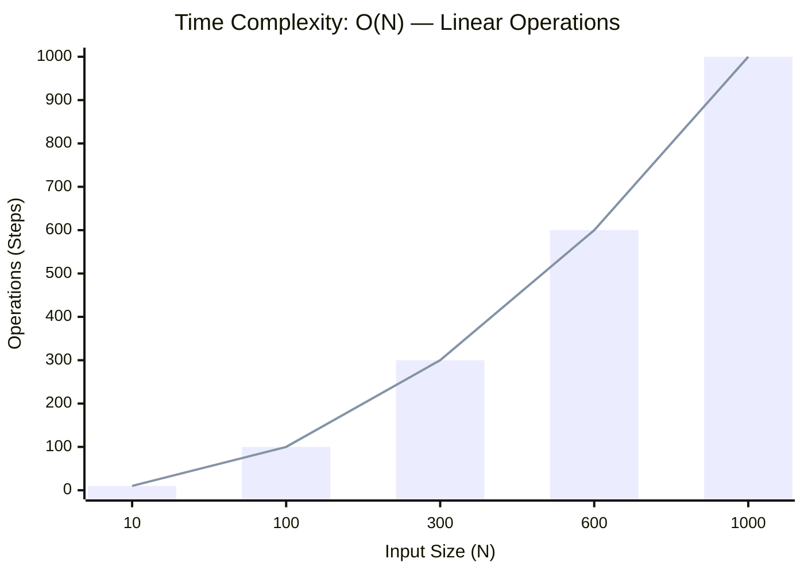

<h2><a href="https://leetcode.com/problems/insertion-sort-list/submissions/2123524692/">Insertion Sort List</a></h2><h3>Medium</h3>

Given the head of a singly linked list, sort the list using insertion sort, and return the sorted list's head.

The steps of the insertion sort algorithm:

Insertion sort iterates, consuming one input element each repetition and growing a sorted output list. 	At each iteration, insertion sort removes one element from the input data, finds the location it belongs within the sorted list and inserts it there. 	It repeats until no input elements remain.

The following is a graphical example of the insertion sort algorithm. The partially sorted list (black) initially contains only the first element in the list. One element (red) is removed from the input data and inserted in-place into the sorted list with each iteration.

Example 1:

Input: head = [4,2,1,3] Output: [1,2,3,4]

Example 2:

Input: head = [-1,5,3,4,0] Output: [-1,0,3,4,5]

Constraints:

The number of nodes in the list is in the range [1, 5000]. 	-5000 <= Node.val <= 5000

### 📊 Submission Statistics
- **Language:** `cpp`
- **Runtime:** `0 ms`
- **Memory:** `N/A`
- **Submission Date:** Sat, 29 Aug 2026 06:20:14 GMT

---

### 💡 Approach & Complexity Analysis
#### 🧠 Intuition & Algorithmic Strategy
- **Approach:** Utilizes frequency counting or presence tracking via hash mapping for O(1) membership queries.
- **Flow:**
  1. Initialize state variables and inspect base constraints.
  2. Iterate through input elements, maintaining current progress and boundaries.
  3. Return the calculated result satisfying problem criteria.

#### ⏱️ Complexity Analysis
- **Time Complexity:** $\mathcal{O}(N)$ — *Single linear pass over the input collection.*
- **Space Complexity:** $\mathcal{O}(N)$ — *Auxiliary hash-based lookup structure storing up to N elements.*

#### 📈 Time Complexity Graph (Operations vs Input Size $N$)

#### 📦 Space Complexity Graph (Memory Footprint vs Input Size $N$)

---
*Auto-synced with [LeetGitSyncPro](https://synccode-pro.pages.dev) & [DSATracker](https://dsatracker.in)*
