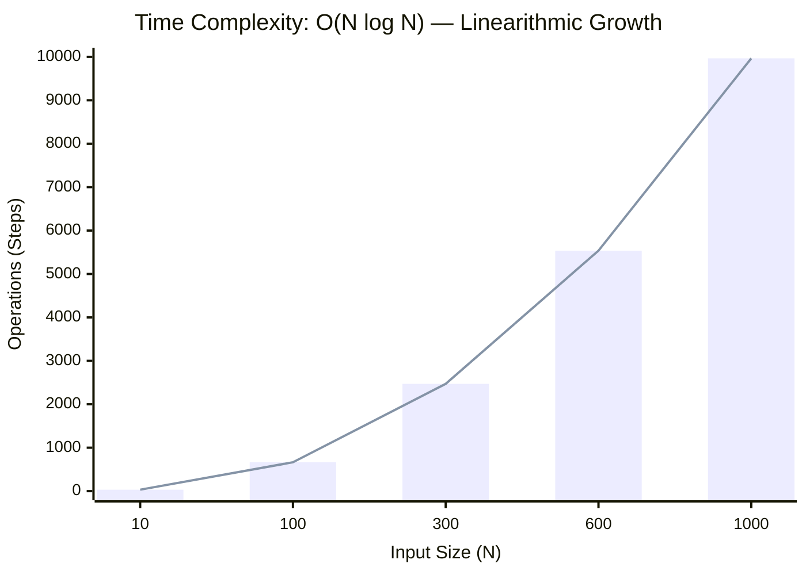
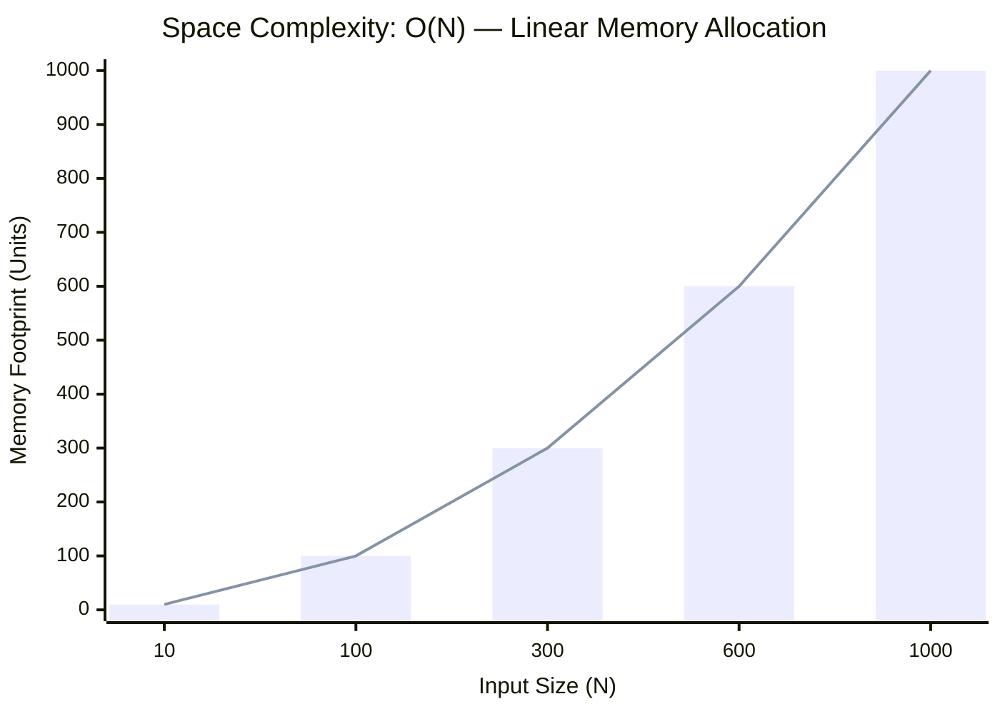

<h2><a href="https://leetcode.com/problems/kth-largest-element-in-an-array/submissions/2123853407/">Kth Largest Element in an Array</a></h2><h3>Medium</h3>

Given an integer array <code>nums</code> and an integer <code>k</code>, return <em>the</em> <code>kth</code> <em>largest element in the array</em>.

Note that it is the <code>kth</code> largest element in the sorted order, not the <code>kth</code> distinct element.

Can you solve it without sorting?

&nbsp;

<strong class="example">Example 1:</strong>

<pre><strong>Input:</strong> nums = [3,2,1,5,6,4], k = 2
<strong>Output:</strong> 5
</pre>
<strong class="example">Example 2:</strong>

<pre><strong>Input:</strong> nums = [3,2,3,1,2,4,5,5,6], k = 4
<strong>Output:</strong> 4
</pre>

&nbsp;

<strong>Constraints:</strong>

<ul>
	<li><code>1 &lt;= k &lt;= nums.length &lt;= 105</code></li>
	<li><code>-104 &lt;= nums[i] &lt;= 104</code></li>
</ul>

### 📊 Submission Statistics
- **Language:** `cpp`
- **Runtime:** `0 ms`
- **Memory:** `N/A`
- **Submission Date:** Sat, 29 Aug 2026 13:17:14 GMT

---

### 💡 Approach & Complexity Analysis
#### 🧠 Intuition & Algorithmic Strategy
- **Approach:** Utilizes frequency counting or presence tracking via hash mapping for O(1) membership queries.
- **Flow:**
  1. Initialize state variables and inspect base constraints.
  2. Iterate through input elements, maintaining current progress and boundaries.
  3. Return the calculated result satisfying problem criteria.

#### ⏱️ Complexity Analysis
- **Time Complexity:** $\mathcal{O}(N \log K)$ — *Heap push/pop operations for priority elements.*
- **Space Complexity:** $\mathcal{O}(N)$ — *Auxiliary hash-based lookup structure storing up to N elements.*

#### 📈 Time Complexity Graph (Operations vs Input Size $N$)

#### 📦 Space Complexity Graph (Memory Footprint vs Input Size $N$)

---
*Auto-synced with [LeetGitSyncPro](https://synccode-pro.pages.dev) & [DSATracker](https://dsatracker.in)*
