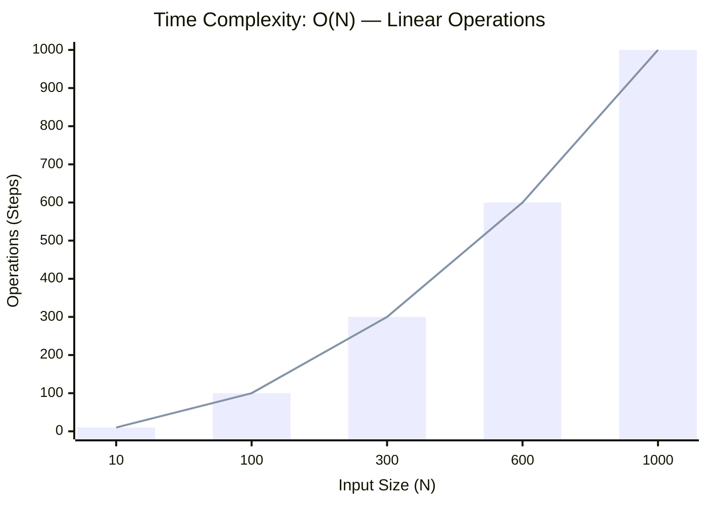

<h2><a href="https://leetcode.com/problems/longest-substring-without-repeating-characters/">Longest Substring Without Repeating Characters</a></h2><h3>Medium</h3>

Given a string s, find the length of the longest substring without duplicate characters.

Example 1:

Input: s = "abcabcbb" Output: 3 Explanation: The answer is "abc", with the length of 3. Note that "bca" and "cab" are also correct answers.

Example 2:

Input: s = "bbbbb" Output: 1 Explanation: The answer is "b", with the length of 1.

Example 3:

Input: s = "pwwkew" Output: 3 Explanation: The answer is "wke", with the length of 3. Notice that the answer must be a substring, "pwke" is a subsequence and not a substring.

Constraints:

0 <= s.length <= 105 s consists of English letters, digits, symbols and spaces.

### 📊 Submission Statistics
- **Language:** `cpp`
- **Runtime:** `0 ms`
- **Memory:** `N/A`
- **Submission Date:** Sat, 29 Aug 2026 05:53:41 GMT

---

### 💡 Approach & Complexity Analysis
#### 🧠 Intuition & Algorithmic Strategy
- **Approach:** Utilizes frequency counting or presence tracking via hash mapping for O(1) membership queries.
- **Flow:**
  1. Initialize state variables and inspect base constraints.
  2. Iterate through input elements, maintaining current progress and boundaries.
  3. Return the calculated result satisfying problem criteria.

#### ⏱️ Complexity Analysis
- **Time Complexity:** $\mathcal{O}(N)$ — *Single linear pass over the input collection.*
- **Space Complexity:** $\mathcal{O}(N)$ — *Auxiliary hash-based lookup structure storing up to N elements.*

#### 📈 Time Complexity Graph (Operations vs Input Size $N$)

#### 📦 Space Complexity Graph (Memory Footprint vs Input Size $N$)

---
*Auto-synced with [LeetGitSyncPro](https://synccode-pro.pages.dev) & [DSATracker](https://dsatracker.in)*
