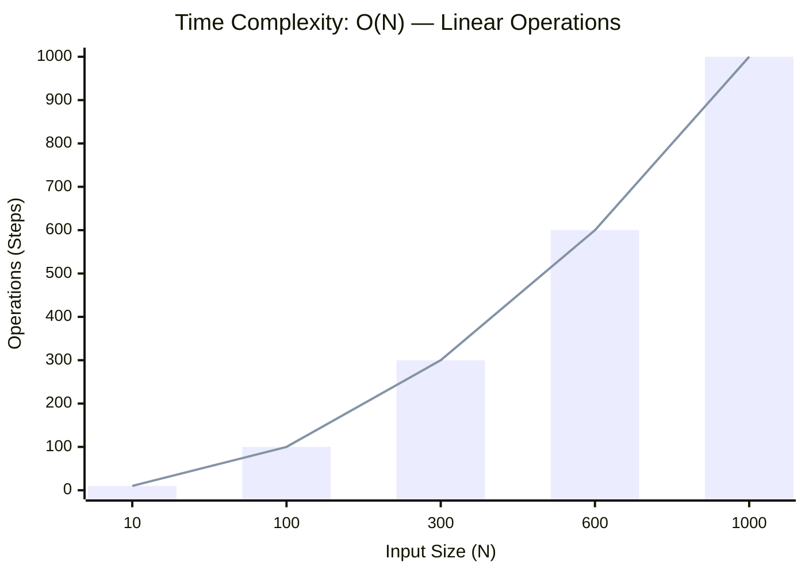

<h2><a href="https://leetcode.com/problems/longest-valid-parentheses/submissions/2123500341/">Longest Valid Parentheses</a></h2><h3>Hard</h3>

Given a string containing just the characters '(' and ')', return the length of the longest valid (well-formed) parentheses substring.

Example 1:

Input: s = "(()" Output: 2 Explanation: The longest valid parentheses substring is "()".

Example 2:

Input: s = ")()())" Output: 4 Explanation: The longest valid parentheses substring is "()()".

Example 3:

Input: s = "" Output: 0

Constraints:

0 <= s.length <= 3 * 104 	s[i] is '(', or ')'.

### 📊 Submission Statistics
- **Language:** `cpp`
- **Runtime:** `0 ms`
- **Memory:** `N/A`
- **Submission Date:** Sat, 29 Aug 2026 05:52:22 GMT

---

### 💡 Approach & Complexity Analysis
#### 🧠 Intuition & Algorithmic Strategy
- **Approach:** Utilizes frequency counting or presence tracking via hash mapping for O(1) membership queries.
- **Flow:**
  1. Initialize state variables and inspect base constraints.
  2. Iterate through input elements, maintaining current progress and boundaries.
  3. Return the calculated result satisfying problem criteria.

#### ⏱️ Complexity Analysis
- **Time Complexity:** $\mathcal{O}(N)$ — *Single linear pass over the input collection.*
- **Space Complexity:** $\mathcal{O}(N)$ — *Auxiliary hash-based lookup structure storing up to N elements.*

#### 📈 Time Complexity Graph (Operations vs Input Size $N$)

#### 📦 Space Complexity Graph (Memory Footprint vs Input Size $N$)

---
*Auto-synced with [LeetGitSyncPro](https://synccode-pro.pages.dev) & [DSATracker](https://dsatracker.in)*
