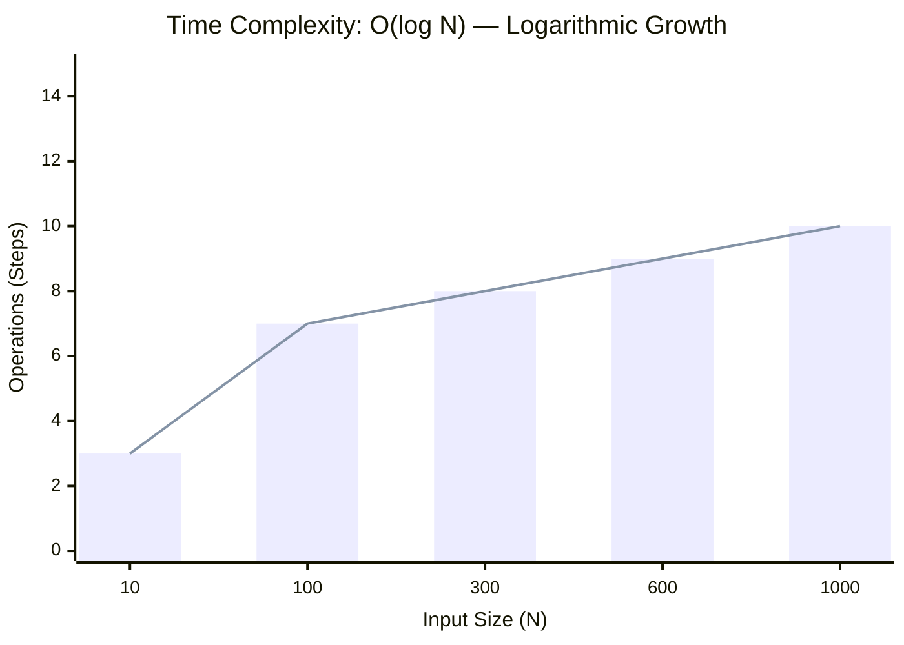
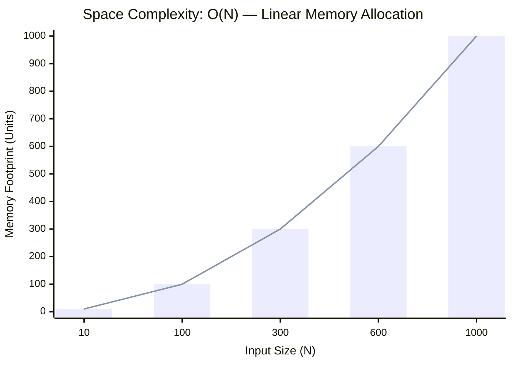

<h2><a href="https://leetcode.com/problems/median-of-two-sorted-arrays/submissions/2123516799/">Median of Two Sorted Arrays</a></h2><h3>Hard</h3>

Given two sorted arrays nums1 and nums2 of size m and n respectively, return the median of the two sorted arrays.

The overall run time complexity should be O(log (m+n)).

Example 1:

Input: nums1 = [1,3], nums2 = [2] Output: 2.00000 Explanation: merged array = [1,2,3] and median is 2.

Example 2:

Input: nums1 = [1,2], nums2 = [3,4] Output: 2.50000 Explanation: merged array = [1,2,3,4] and median is (2 + 3) / 2 = 2.5.

Constraints:

nums1.length == m 	nums2.length == n 	0 <= m <= 1000 	0 <= n <= 1000 	1 <= m + n <= 2000 	-106 <= nums1[i], nums2[i] <= 106

### 📊 Submission Statistics
- **Language:** `cpp`
- **Runtime:** `0 ms`
- **Memory:** `N/A`
- **Submission Date:** Sat, 29 Aug 2026 06:11:30 GMT

---

### 💡 Approach & Complexity Analysis
#### 🧠 Intuition & Algorithmic Strategy
- **Approach:** Performs logarithmic range reduction to locate target elements in monotonic space.
- **Flow:**
  1. Initialize state variables and inspect base constraints.
  2. Iterate through input elements, maintaining current progress and boundaries.
  3. Return the calculated result satisfying problem criteria.

#### ⏱️ Complexity Analysis
- **Time Complexity:** $\mathcal{O}(\log N)$ — *Binary search halving the search space each iteration.*
- **Space Complexity:** $\mathcal{O}(N)$ — *Auxiliary hash-based lookup structure storing up to N elements.*

#### 📈 Time Complexity Graph (Operations vs Input Size $N$)

#### 📦 Space Complexity Graph (Memory Footprint vs Input Size $N$)

---
*Auto-synced with [LeetGitSyncPro](https://synccode-pro.pages.dev) & [DSATracker](https://dsatracker.in)*
