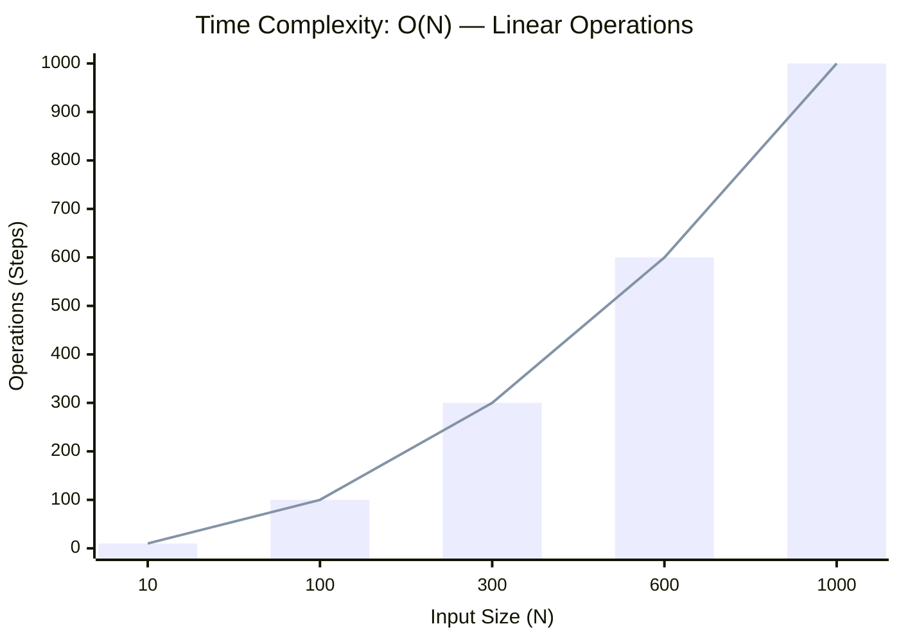

<h2><a href="https://leetcode.com/problems/second-largest-digit-in-a-string/submissions/2123905832/">Second Largest Digit in a String</a></h2><h3>Easy</h3>

Given an alphanumeric string <code>s</code>, return <em>the <strong>second largest</strong> numerical digit that appears in </em><code>s</code><em>, or </em><code>-1</code><em> if it does not exist</em>.

An <strong>alphanumeric</strong><strong> </strong>string is a string consisting of lowercase English letters and digits.

&nbsp;

<strong class="example">Example 1:</strong>

<pre><strong>Input:</strong> s = "dfa12321afd"
<strong>Output:</strong> 2
<strong>Explanation:</strong> The digits that appear in s are [1, 2, 3]. The second largest digit is 2.
</pre>

<strong class="example">Example 2:</strong>

<pre><strong>Input:</strong> s = "abc1111"
<strong>Output:</strong> -1
<strong>Explanation:</strong> The digits that appear in s are [1]. There is no second largest digit. 
</pre>

&nbsp;

<strong>Constraints:</strong>

<ul>
	<li><code>1 &lt;= s.length &lt;= 500</code></li>
	<li><code>s</code> consists of only lowercase English letters and digits.</li>
</ul>

### 📊 Submission Statistics
- **Language:** `cpp`
- **Runtime:** `0 ms`
- **Memory:** `N/A`
- **Submission Date:** Sat, 29 Aug 2026 14:17:32 GMT

---

### 💡 Approach & Complexity Analysis
#### 🧠 Intuition & Algorithmic Strategy
- **Approach:** Utilizes frequency counting or presence tracking via hash mapping for O(1) membership queries.
- **Flow:**
  1. Initialize state variables and inspect base constraints.
  2. Iterate through input elements, maintaining current progress and boundaries.
  3. Return the calculated result satisfying problem criteria.

#### ⏱️ Complexity Analysis
- **Time Complexity:** $\mathcal{O}(N)$ — *Single linear pass over the input collection.*
- **Space Complexity:** $\mathcal{O}(N)$ — *Auxiliary hash-based lookup structure storing up to N elements.*

#### 📈 Time Complexity Graph (Operations vs Input Size $N$)

#### 📦 Space Complexity Graph (Memory Footprint vs Input Size $N$)

---
*Auto-synced with [LeetGitSyncPro](https://synccode-pro.pages.dev) & [DSATracker](https://dsatracker.in)*
