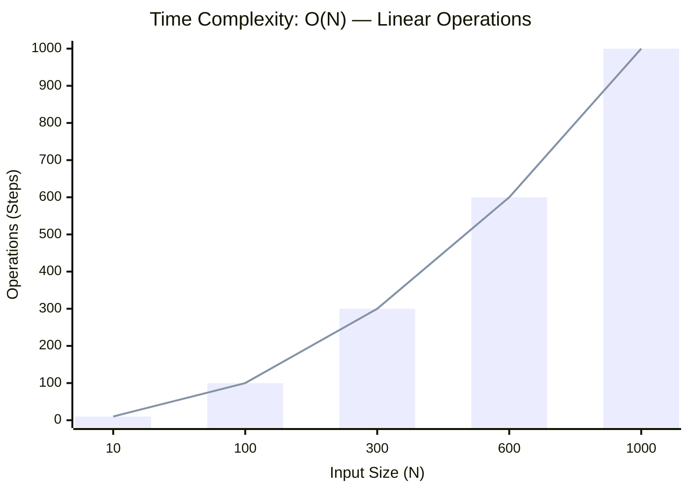

<h2><a href="https://leetcode.com/problems/sort-an-array/submissions/2123536131/">Sort an Array</a></h2><h3>Medium</h3>

Given an array of integers <code>nums</code>, sort the array in ascending order and return it.

You must solve the problem <strong>without using any built-in</strong> functions in <code>O(nlog(n))</code> time complexity and with the smallest space complexity possible.

&nbsp;

<strong class="example">Example 1:</strong>

<pre><strong>Input:</strong> nums = [5,2,3,1]
<strong>Output:</strong> [1,2,3,5]
<strong>Explanation:</strong> After sorting the array, the positions of some numbers are not changed (for example, 2 and 3), while the positions of other numbers are changed (for example, 1 and 5).
</pre>

<strong class="example">Example 2:</strong>

<pre><strong>Input:</strong> nums = [5,1,1,2,0,0]
<strong>Output:</strong> [0,0,1,1,2,5]
<strong>Explanation:</strong> Note that the values of nums are not necessarily unique.
</pre>

&nbsp;

<strong>Constraints:</strong>

<ul>
	<li><code>1 &lt;= nums.length &lt;= 5 * 104</code></li>
	<li><code>-5 * 104 &lt;= nums[i] &lt;= 5 * 104</code></li>
</ul>

### 📊 Submission Statistics
- **Language:** `cpp`
- **Runtime:** `300 ms`
- **Memory:** `N/A`
- **Submission Date:** Sat, 29 Aug 2026 06:32:47 GMT

---

### 💡 Approach & Complexity Analysis
#### 🧠 Intuition & Algorithmic Strategy
- **Approach:** Utilizes frequency counting or presence tracking via hash mapping for O(1) membership queries.
- **Flow:**
  1. Initialize state variables and inspect base constraints.
  2. Iterate through input elements, maintaining current progress and boundaries.
  3. Return the calculated result satisfying problem criteria.

#### ⏱️ Complexity Analysis
- **Time Complexity:** $\mathcal{O}(N)$ — *Single linear pass over the input collection.*
- **Space Complexity:** $\mathcal{O}(N)$ — *Auxiliary hash-based lookup structure storing up to N elements.*

#### 📈 Time Complexity Graph (Operations vs Input Size $N$)

#### 📦 Space Complexity Graph (Memory Footprint vs Input Size $N$)

---
*Auto-synced with [LeetGitSyncPro](https://synccode-pro.pages.dev) & [DSATracker](https://dsatracker.in)*
